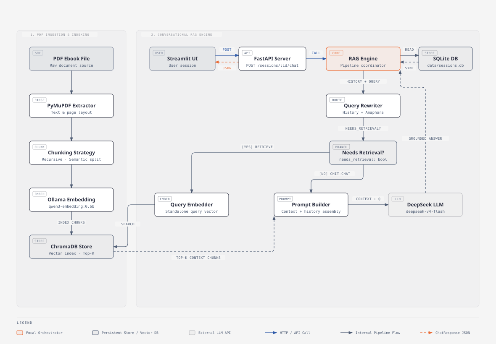
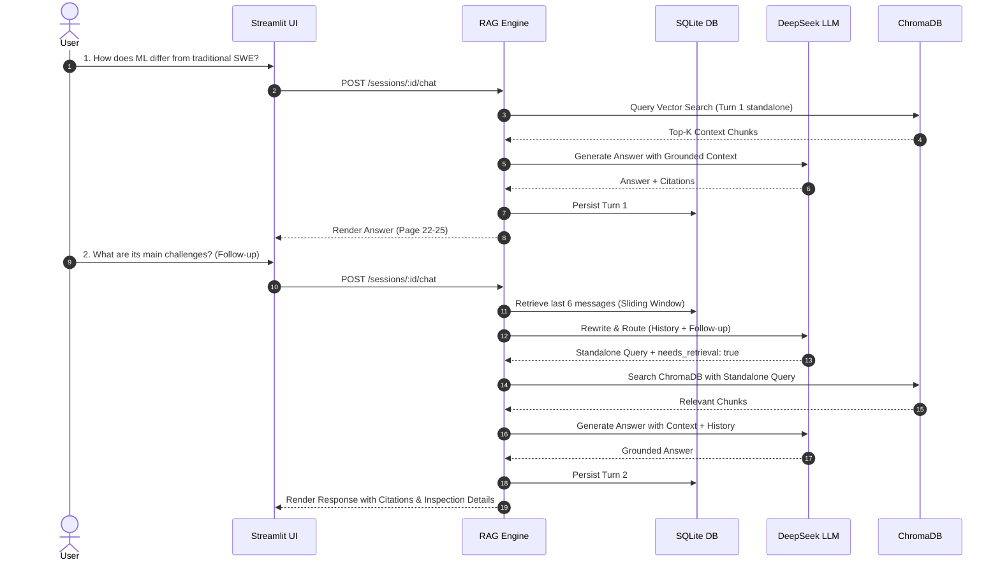

# Exocortex 🧠

> **A Production-Grade Conversational RAG System for English Ebooks**

[](https://www.python.org/downloads/)
[](https://fastapi.tiangolo.com)
[](https://streamlit.io)
[](https://www.trychroma.com)
[](https://www.deepseek.com)
[](https://github.com/explodinggradients/ragas)
[]()

---

## 📖 Table of Contents

- [Overview](#-overview)
- [Key Features](#-key-features)
- [System Architecture](#-system-architecture)
- [Engineering Deep Dives](#-engineering-deep-dives)
  - [1. Modular Chunking Strategies & Empirical Benchmark](#1-modular-chunking-strategies--empirical-benchmark)
  - [2. Multi-Turn Conversation & Query Rewriting Router](#2-multi-turn-conversation--query-rewriting-router)
- [Tech Stack](#-tech-stack)
- [Getting Started](#-getting-started)
  - [Prerequisites](#prerequisites)
  - [Installation & Setup](#installation--setup)
  - [Running the Application](#running-the-application)
- [REST API Reference](#-rest-api-reference)
- [Running Benchmarks & Tests](#-running-benchmarks--tests)
- [Roadmap & Limitations](#-roadmap--limitations)

---

## 🌟 Overview

**Exocortex** is an end-to-end Retrieval-Augmented Generation (RAG) system built to transform static English PDF ebooks into interactive, context-aware knowledge bases. 

Unlike naive RAG implementations, Exocortex features:
1. **Empirically Benchmarked Chunking**: Evaluated across 4 chunking strategies using **Ragas** on a curated golden dataset from technical literature.
2. **Context-Aware Multi-Turn Dialogue**: Incorporates **Query Rewriting**, an **LLM Light Router**, and a **Sliding History Window** to support seamless conversational follow-ups without context drift or unnecessary retrieval overhead.
3. **Transparent & Grounded Answers**: DeepSeek LLM generates hallucination-resistant answers with precise page-level citations.

---

## 🚀 Key Features

- 📑 **Robust PDF Ingestion**: Extracts clean text layer using PyMuPDF (fitz) with automatic duplicate detection via SHA-256 hashing.
- 🧩 **Modular Chunking Architecture**: Pluggable chunking strategies implemented via the Strategy pattern (`fixed`, `recursive`, `sentence_paragraph`, `semantic`).
- 📊 **Automated Evaluation Suite**: Built-in benchmarking pipeline computing both traditional retrieval metrics (Hit Rate@K, MRR) and Ragas metrics (Context Precision, Context Recall, Faithfulness, Answer Relevancy).
- 💬 **Stateful Conversational Memory**: Relational SQLite storage (`sessions.db`) tracking multi-turn dialogue histories.
- 🔀 **Query Rewriting & Intent Routing**: Pre-retrieval LLM step that resolves pronouns/context in follow-up queries and bypasses vector retrieval for conversational chit-chat or history summaries.
- 🖥️ **Modern Streamlit UI**: ChatGPT-style interface featuring a session history sidebar, collapsible technical inspection cards (rewritten queries, citations, token usage), and an interactive PDF upload manager.
- ⚡ **High-Performance REST API**: Production-ready FastAPI endpoints with automated Swagger UI and ReDoc documentation.

---

## 🏗️ System Architecture



---

## 🔬 Engineering Deep Dives

### 1. Modular Chunking Strategies & Empirical Benchmark

Text chunking directly determines the quality of RAG retrieval. Exocortex implements a modular framework under `src/exocortex/chunking/` with four distinct strategies:

1. **`FixedSizeChunker`** *(Baseline)*: Fixed token/character sliding window (`chunk_size=512`, `chunk_overlap=50`).
2. **`RecursiveCharacterChunker`**: Hierarchical recursive splitting across paragraph (`\n\n`), sentence (`\n`, `. `), and word boundaries, maintaining semantic cohesiveness.
3. **`SentenceParagraphChunker`**: Regex-based sentence boundary detection grouped within paragraphs with sliding sentence overlap.
4. **`SemanticChunker`**: Embeds individual sentences, computes consecutive cosine distance, and identifies semantic transition breakpoints via percentile thresholding.

#### 📊 Ragas Benchmark Results

We evaluated all four strategies against a curated **Golden Dataset** (22 ground-truth Q&As with exact page citations from Chip Huyen's *Designing Machine Learning Systems*, Chapter 1) using **Ragas** and traditional retrieval metrics:

| Strategy | Chunks | Avg Len | HitRate@K | MRR | Context Precision | Context Recall | Faithfulness | Answer Relevancy | Latency |
| :--- | :---: | :---: | :---: | :---: | :---: | :---: | :---: | :---: | :---: |
| **`fixed`** | 118 | 510 chars | 1.000 | 0.955 | 0.849 | 0.726 | 0.807 | 0.808 | 327.1 ms |
| **`recursive`** ⭐ | **117** | **472 chars** | **1.000** | **0.977** | **0.925** | **0.750** | **0.853** | **0.890** | **351.4 ms** |
| **`sentence_paragraph`** | 190 | 445 chars | 1.000 | 0.955 | 0.763 | 0.677 | 0.812 | 0.899 | 403.9 ms |
| **`semantic`** | 84 | 646 chars | 1.000 | 0.932 | 0.780 | 0.833 | 0.892 | 0.917 | 373.0 ms |

#### 🏆 Key Findings & Production Selection
- **`recursive`** achieved the highest **Mean Reciprocal Rank (0.977)** and **Context Precision (0.925)** while maintaining strong Faithfulness (0.853) and minimal latency overhead (351 ms).
- By preserving natural paragraph and sentence boundaries, `recursive` prevents fragmented facts from polluting the vector space.
- **Decision:** Exocortex sets `CHUNKING_STRATEGY=recursive` as the default production configuration.

---

### 2. Multi-Turn Conversation & Query Rewriting Router

Standard RAG systems fail when users ask follow-up questions containing pronouns or implicit context (*"What are its advantages?"*, *"Can you elaborate on the second method?"*).

Exocortex resolves this via a multi-turn conversation pipeline:



- **Light Router**: Skips vector retrieval for greetings, conversational chit-chat, or synthesis of prior conversation turns, reducing latency and embedding costs.
- **Sliding History Window**: Maintains $K=3$ recent Q&A turns (6 messages) directly in the LLM context prompt to ensure conversational coherence.

---

## 🛠️ Tech Stack

| Layer | Technology | Details |
|---|---|---|
| **Language & Tooling** | Python 3.12+, `uv` | Fast package management and virtual environment sync |
| **PDF Ingestion** | PyMuPDF (fitz) | Fast text and layout extraction |
| **Embedding Model** | `qwen3-embedding:0.6b` via Ollama | Local 1024-dimensional vectors, 32k context support |
| **Vector Store** | ChromaDB | Persistent embedded vector database |
| **Primary LLM** | DeepSeek (`deepseek-v4-flash`) | OpenAI-compatible API endpoint (`temp=0.1`) |
| **Conversational State** | SQLite (`data/sessions.db`) | Relational persistence with cascade delete & metadata indexing |
| **Evaluation Framework** | Ragas + Pandas | Automated Context Precision, Recall, Faithfulness, Relevancy |
| **API Backend** | FastAPI + Uvicorn | Async REST API with OpenAPI/Swagger docs |
| **User Interface** | Streamlit | Chat interface with technical inspection expanders |

---

## 🚀 Getting Started

### Prerequisites

1. **Python 3.12+** and [`uv`](https://docs.astral.sh/uv/) installed.
2. **Ollama** running locally with the embedding model:
   ```bash
   ollama pull qwen3-embedding:0.6b
   ```
3. A **DeepSeek API Key** (from [platform.deepseek.com](https://platform.deepseek.com)).

### Installation & Setup

1. **Clone the repository:**
   ```bash
   git clone https://github.com/quocdat22/Exocortex.git
   cd Exocortex
   ```

2. **Install dependencies with `uv`:**
   ```bash
   uv sync
   ```

3. **Configure Environment Variables:**
   ```bash
   cp .env.example .env
   ```
   Edit `.env` with your API key:
   ```ini
   DEEPSEEK_API_KEY=your_deepseek_api_key_here
   DEEPSEEK_BASE_URL=https://api.deepseek.com
   DEEPSEEK_MODEL=deepseek-v4-flash
   OLLAMA_BASE_URL=http://localhost:11434
   EMBEDDING_MODEL=qwen3-embedding:0.6b
   CHUNKING_STRATEGY=recursive
   CHUNK_SIZE=512
   CHUNK_OVERLAP=50
   TOP_K=5
   ```

### Running the Application

1. **Start the FastAPI Backend:**
   ```bash
   uv run uvicorn exocortex.api:app --host 0.0.0.0 --port 8000 --reload
   ```

2. **Start the Streamlit Web UI (in another terminal):**
   ```bash
   uv run streamlit run streamlit_app.py --server.port 8501
   ```

3. **Access Endpoints:**
   - **Streamlit Web UI:** [http://localhost:8501](http://localhost:8501)
   - **Interactive API Docs (Swagger):** [http://localhost:8000/docs](http://localhost:8000/docs)
   - **Alternative API Docs (ReDoc):** [http://localhost:8000/redoc](http://localhost:8000/redoc)

---

## 📡 REST API Reference

| Method | Endpoint | Description |
|---|---|---|
| `GET` | `/health` | Health status of Ollama, ChromaDB, and DeepSeek LLM |
| `POST` | `/ingest` | Upload & index PDF (supports `strategy` override & duplicate detection) |
| `POST` | `/query` | Stateless single-turn RAG query |
| `POST` | `/sessions` | Create a new conversational session |
| `GET` | `/sessions` | List all conversation sessions sorted by recent activity |
| `GET` | `/sessions/{id}` | Get session details and full message history |
| `DELETE` | `/sessions/{id}` | Delete a session and its message history |
| `POST` | `/sessions/{id}/chat` | Multi-turn conversational chat with query rewriting & routing |
| `GET` | `/documents` | List all indexed PDF documents with chunk counts |
| `DELETE` | `/documents/{id}` | Remove a document and its chunks from ChromaDB |

### Example cURL Commands

<details>
<summary><b>1. Ingest a PDF Ebook</b></summary>

```bash
curl -X POST "http://localhost:8000/ingest?strategy=recursive" \
  -F "file=@data/ebooks/sample_ebook.pdf"
```
</details>

<details>
<summary><b>2. Create a Session & Send a Multi-Turn Chat</b></summary>

```bash
# Create Session
SESSION_ID=$(curl -s -X POST "http://localhost:8000/sessions" \
  -H "Content-Type: application/json" \
  -d '{"title": "ML Systems Discussion"}' | jq -r .id)

# Send Question
curl -X POST "http://localhost:8000/sessions/$SESSION_ID/chat" \
  -H "Content-Type: application/json" \
  -d '{"question": "What is the difference between ML systems and traditional software?"}'
```
</details>

---

## 🧪 Running Benchmarks & Tests

### Run the Evaluation Benchmark Suite
To execute an end-to-end evaluation across all four chunking strategies against the Golden Dataset:

```bash
uv run python -m exocortex.eval.benchmark
```
*Outputs are saved to `docs/benchmark_results.md` and `data/benchmark_results.csv`.*

### Run Unit & Integration Tests
Execute the complete test suite (160+ tests covering chunkers, ingestion, vector store, sessions, LLM rewriting, API endpoints):

```bash
uv run pytest -v
```


---

## 🛣️ Roadmap & Limitations

- [x] Multi-turn conversation history & session persistence.
- [x] Query rewriting & light router for conversational search.
- [x] Modular chunking strategies with empirical Ragas benchmarking.
- [ ] **Hybrid Search**: Combining dense semantic search with sparse lexical search (BM25).
- [ ] **Re-ranking**: Cross-encoder re-ranking (e.g., BGE-Reranker) to refine top-K candidates.
- [ ] **Multimodal / OCR Support**: Ingestion of scanned PDF books via OCR models.

---

## 📄 License

This project is open-source under the [MIT License](LICENSE).
