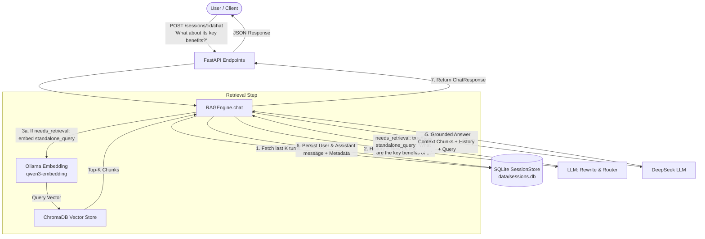

# Design Specification: Conversation History & Session Management (Multi-turn RAG)

**Date:** 2026-08-21  
**Status:** Approved  
**Author:** Pair Programming Agent & User  
**Target Branch:** `feature/conversation-history`  

---

## 1. Overview & Objectives

In version 0.1.0, Exocortex operates as a purely stateless RAG system — each query to `/query` or the Streamlit UI is processed in isolation without memory of prior exchanges. Users cannot ask follow-up questions (e.g., *"What are its main benefits?"*, *"Can you elaborate on the second point you just mentioned?"*), significantly limiting conversational search and exploratory reading.

This project implements **Multi-turn Conversation History & Session Management** to resolve Limitation #4 from `docs/06-limitations-roadmap.md`.

### Key Design Pillars
1. **SQLite Session & Message Persistence**: File-backed relational storage (`data/sessions.db`) ensuring session durability across server restarts.
2. **Query Rewriting + Light Router**: Prior to retrieval, an LLM call inspects the sliding history window ($K=3\text{--}5$ turns) and the latest question to:
   - Route whether new vector retrieval from ChromaDB is needed (`needs_retrieval: bool`).
   - Rewrite pronoun-laden / contextual follow-ups into standalone search queries (`standalone_query: str`).
3. **Sliding Window History Injection**: Feed recent conversational turns alongside retrieved context chunks to the final answer generation prompt.
4. **Session-Centric REST API**: New endpoints (`/sessions`, `/sessions/{id}/chat`, etc.) while retaining `/query` for 100% backward compatibility.
5. **ChatGPT-Style Streamlit UI**: Multi-session management sidebar, chat message bubbles, and collapsible inspection of query rewriting, routing decisions, and source citations.

---

## 2. Architecture & Data Flow



---

## 3. Component Specifications

### 3.1 Session & Storage Layer (`src/exocortex/session.py`)

- **Database**: SQLite file located at `settings.sessions_db_path` (default: `./data/sessions.db`).
- **Schema**:
  ```sql
  CREATE TABLE IF NOT EXISTS sessions (
      id TEXT PRIMARY KEY,
      title TEXT NOT NULL,
      created_at TIMESTAMP NOT NULL,
      updated_at TIMESTAMP NOT NULL
  );

  CREATE TABLE IF NOT EXISTS messages (
      id TEXT PRIMARY KEY,
      session_id TEXT NOT NULL,
      role TEXT NOT NULL,
      content TEXT NOT NULL,
      standalone_query TEXT,
      needs_retrieval INTEGER DEFAULT 1,
      sources_json TEXT,
      model TEXT,
      usage_json TEXT,
      created_at TIMESTAMP NOT NULL,
      FOREIGN KEY(session_id) REFERENCES sessions(id) ON DELETE CASCADE
  );

  CREATE INDEX IF NOT EXISTS idx_messages_session ON messages(session_id, created_at);
  ```

- **Dataclasses**:
  ```python
  @dataclass
  class Message:
      id: str
      session_id: str
      role: str  # "user" | "assistant" | "system"
      content: str
      standalone_query: str | None = None
      needs_retrieval: bool = True
      sources: list[dict] = field(default_factory=list)
      model: str | None = None
      usage: dict | None = None
      created_at: str = ""

  @dataclass
  class Session:
      id: str
      title: str
      created_at: str
      updated_at: str
      messages: list[Message] = field(default_factory=list)
  ```

- **Interface (`SessionStore`)**:
  - `create_session(title: str | None = None) -> Session`
  - `get_session(session_id: str, include_messages: bool = True) -> Session | None`
  - `list_sessions() -> list[Session]`
  - `update_session_title(session_id: str, title: str) -> None`
  - `delete_session(session_id: str) -> bool`
  - `add_message(session_id: str, role: str, content: str, standalone_query: str | None = None, needs_retrieval: bool = True, sources: list[dict] | None = None, model: str | None = None, usage: dict | None = None) -> Message`
  - `get_recent_messages(session_id: str, limit: int = 6) -> list[Message]`

---

### 3.2 LLM Rewriter, Router & History Context (`src/exocortex/llm.py`)

#### Combined Rewrite & Router Prompt:
```python
REWRITE_ROUTER_PROMPT = """You are an AI assistant analyzing a conversation for a RAG retrieval system.
Given the chat history and a follow-up question from the user:
1. Determine if the question needs document retrieval from the ebook vector database (needs_retrieval = true/false).
   - Set needs_retrieval to false for greetings, conversational chit-chat, requests to clarify/summarize what was ALREADY said in the chat history.
   - Set needs_retrieval to true if the question asks for factual information, book content, definitions, or new topics.
2. Rewrite the user's follow-up question into a complete, standalone question in English that incorporates any missing context or references (pronouns like 'it', 'they', 'that method', 'the previous chapter', etc.) from the conversation history. If the question is already standalone, return it unchanged.

Respond ONLY with valid JSON in this exact structure:
{
  "needs_retrieval": true,
  "standalone_query": "Standalone reformulated question here"
}
"""
```

- **Method `LLMClient.rewrite_and_route(history: list[Message], question: str) -> tuple[str, bool]`**:
  - If `history` is empty: returns `(question, True)` immediately (bypassing extra LLM call on turn 1).
  - Otherwise, sends prompt + JSON format constraint to DeepSeek. Fallback to `(question, True)` on parse error.

- **Method `LLMClient.generate_with_history(messages_history: list[Message], query: str, search_results: list[SearchResult]) -> LLMResponse`**:
  - Formats retrieved chunks as `SYSTEM_PROMPT` context.
  - Constructs messages payload:
    `[{"role": "system", "content": system_prompt_with_context}]`
    + `[{"role": msg.role, "content": msg.content} for msg in recent_history]`
    + `[{"role": "user", "content": query}]`
  - Calls DeepSeek completions API and returns `LLMResponse`.

---

### 3.3 Retrieval Engine Multi-turn Pipeline (`src/exocortex/retrieval.py`)

- **Dataclass `ChatResponse`**:
  ```python
  @dataclass
  class ChatResponse:
      answer: str
      sources: list[dict]
      query: str
      standalone_query: str
      needs_retrieval: bool
      session_id: str
      num_chunks_retrieved: int
      model: str
      usage: dict | None = None
  ```

- **Method `RAGEngine.chat(session_id: str, question: str) -> ChatResponse`**:
  1. Retrieve or auto-create session via `SessionStore`.
  2. Load last $2 \times K$ messages (e.g. $K=3$ pairs = 6 messages).
  3. Call `llm_client.rewrite_and_route(history, question)` $\rightarrow$ `(standalone_query, needs_retrieval)`.
  4. If `needs_retrieval`:
     - Embed `standalone_query` with Ollama.
     - Search ChromaDB for top-K chunks.
     Else:
     - `search_results = []`.
  5. Generate answer using `llm_client.generate_with_history(history, question, search_results)`.
  6. Save `user` message and `assistant` message to `SessionStore`.
  7. If session title is default or first turn, derive a clean title (first 40 characters of question or summary).
  8. Return `ChatResponse`.

---

### 3.4 API Endpoints (`src/exocortex/api.py`)

| Method | Path | Description |
|---|---|---|
| `POST` | `/sessions` | Create a new chat session (returns `session_id`, `title`, `created_at`). |
| `GET` | `/sessions` | List all sessions sorted by `updated_at DESC`. |
| `GET` | `/sessions/{session_id}` | Get session details + message history. |
| `DELETE` | `/sessions/{session_id}` | Delete session and cascade delete messages. |
| `POST` | `/sessions/{session_id}/chat` | Send a question into a session, execute RAG pipeline, persist turn, return `ChatResponse`. |
| `POST` | `/query` | **Unchanged** stateless endpoint for backward compatibility. |

---

### 3.5 Streamlit User Interface (`streamlit_app.py`)

- **Sidebar Enhancements**:
  - `➕ New Chat` button (clears active session ID in `st.session_state` and triggers new session).
  - Scrollable/expandable list of past sessions with select and 🗑️ delete buttons.
- **Main Chat Interface**:
  - Iterates through messages of the active session and renders them via `st.chat_message("user")` and `st.chat_message("assistant")`.
  - Assistant message cards display:
    - Main response text (markdown).
    - Expander: `🔍 Technical & Retrieval Details` (Standalone Query, Routing flag, and Source citations with page numbers).
  - Bottom `st.chat_input("Ask a question about your books...")` for smooth multi-turn dialogue.

---

## 4. Configuration Updates (`src/exocortex/config.py`)

New settings fields in `Settings`:
- `sessions_db_path: str = "./data/sessions.db"`
- `chat_history_window: int = 3` (3 Q&A pairs = 6 messages)

---

## 5. Testing Strategy

1. **`tests/test_session.py`**:
   - SQLite table creation & initialization.
   - Create, list, retrieve, update title, delete session.
   - Message addition and sliding window limit retrieval.
   - Cascade deletion when session is removed.
2. **`tests/test_llm.py`**:
   - Unit tests for `rewrite_and_route` with mock responses (first turn bypass, valid JSON parse, fallback handling).
   - Unit tests for `generate_with_history` message list construction.
3. **`tests/test_retrieval.py`**:
   - Multi-turn `RAGEngine.chat` pipeline with mocked LLM and VectorStore.
   - Title auto-updating on initial turn.
4. **`tests/test_api.py`**:
   - Full FastAPI test client coverage for `/sessions`, `/sessions/{id}`, `/sessions/{id}/chat`, `DELETE /sessions/{id}`, and regression on `/query`.
